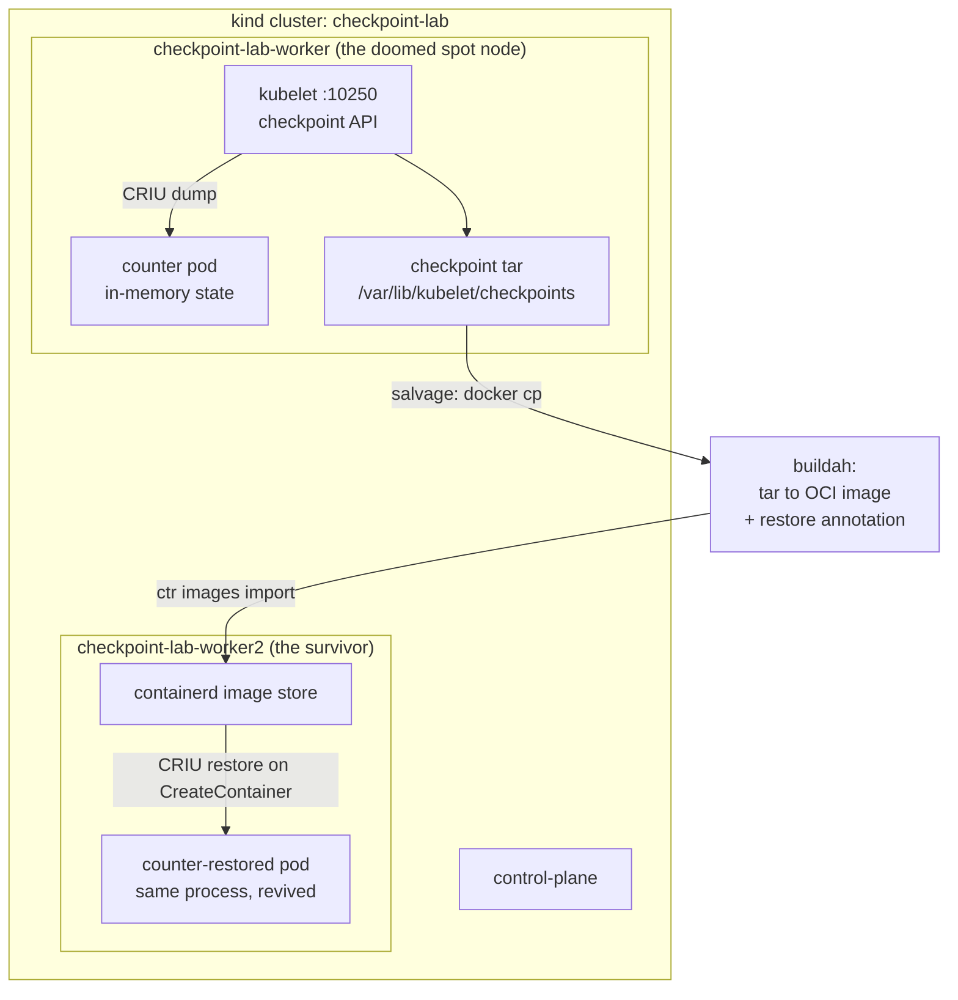

# How to Move a Running Pod Between Kubernetes Nodes and Survive Spot Instance Reclaims

In this article, you'll freeze a live, running process inside a Kubernetes pod — its memory, its open sockets, its half-finished work — carry it off a dying node, and thaw it on another one, where it resumes as if nothing happened. Not with a vendor tool, and not by reading a design doc: you'll do every step by hand on a laptop with [kind](https://kind.sigs.k8s.io/).

"Pods are cattle, not pets" is one of the great dogmas of Kubernetes. When a node dies, its pods die with it, and the scheduler starts *fresh copies* somewhere else. For stateless services that's fine. But a fresh copy of a training job is a job that lost three days of progress. A fresh copy of a warmed-up JVM is a JVM that spends the next ten minutes re-JIT-compiling everything. The pod spec survives — the *work* doesn't.

Your laptop already solves this problem: close the lid, open it on the train, and every app resumes mid-keystroke. That's suspend and resume. Kubernetes is getting the same superpower — checkpoint/restore — and [KEP-5823 (Pod-level Checkpoint/Restore)](https://github.com/kubernetes/enhancements/issues/5823) is the proposal that will make it a native API.

By the end, you'll have checkpointed a stateful pod during a simulated spot-instance "two-minute warning," killed its node mid-flight, salvaged the checkpoint off the dead node's disk, and watched the *same process* — same counter, same in-memory state, even the same internal clock — come back to life on a surviving node. And you'll understand exactly what KEP-5823 automates, because you'll have been the controller yourself.

All the code and scripts are in the [companion repo](https://github.com/shkatara/k8s-criu).

## Table of Contents

- [Prerequisites](#prerequisites)
- [The Problem: Spot Instances Are a Discount With a Countdown Timer](#the-problem-spot-instances-are-a-discount-with-a-countdown-timer)
- [The Idea: Freeze the Process, Not Just the Pod Spec](#the-idea-freeze-the-process-not-just-the-pod-spec)
- [How to Build the Lab](#how-to-build-the-lab)
- [Give the Pod Something to Lose](#give-the-pod-something-to-lose)
- [The Two-Minute Warning: Checkpoint the Container](#the-two-minute-warning-checkpoint-the-container)
- [The Reclaim: Kill the Node](#the-reclaim-kill-the-node)
- [Resurrection: From Tarball to Running Pod](#resurrection-from-tarball-to-running-pod)
- [What Just Happened (and What Didn't)](#what-just-happened-and-what-didnt)
- [The Future: KEP-5823 Makes This Native](#the-future-kep-5823-makes-this-native)
- [Clean Up](#clean-up)
- [Conclusion](#conclusion)

---

## Prerequisites

Before starting, make sure you have:

* [Docker](https://www.docker.com/) (or [OrbStack](https://orbstack.dev/) on macOS) up and running
* [kind](https://kind.sigs.k8s.io/) **v0.33.0 or newer** — the demo is pinned to the `kindest/node:v1.37.0` image, which ships containerd 2.3.4
* [kubectl](https://kubernetes.io/docs/tasks/tools/)

You don't need a cloud account, and you don't need to know anything about CRIU — we'll build that knowledge as we go. The demo works on both amd64 and arm64 (Apple Silicon included), because we build our own tiny app image for whatever architecture your machine has.

**Note:** Checkpoint/restore reaches deep into the kernel, so exact versions matter more than usual in this article. Everything below is pinned and was validated end to end: Kubernetes v1.37.0, containerd 2.3.4, CRIU 4.2.1, kind v0.33.0. Where a version boundary matters, I'll tell you why.

---

## The Problem: Spot Instances Are a Discount With a Countdown Timer

Every major cloud sells you its spare capacity at a steep discount — commonly cited at up to 90% off on-demand prices. The catch is the same everywhere: the cloud can take the machine back whenever it wants, and it doesn't ask nicely.

* **AWS EC2 Spot** gives you a **2-minute interruption notice**, delivered through the instance metadata service (`spot/instance-action`) and as an EventBridge event. AWS recommends polling the metadata endpoint every 5 seconds, and the notice is best-effort — sometimes the two minutes is all you get, sometimes not even that.
* **GCP Spot VMs** send an ACPI shutdown signal and give you roughly **30 seconds**. GKE splits that window between regular and system-critical pods.
* **Azure Spot VMs** surface the eviction through Scheduled Events with — again — about **30 seconds** of warning.

Kubernetes has machinery to make this *graceful*: interruption handlers (aws-node-termination-handler, Karpenter) cordon and drain the node, and the kubelet's [Graceful Node Shutdown](https://kubernetes.io/docs/concepts/cluster-administration/node-shutdown/) feature (beta since v1.21, inert until you set `shutdownGracePeriod`) holds the OS shutdown long enough to terminate pods in order.

Look closely at what all of that machinery does, though: it **kills your pods politely**. Every one of those mechanisms ends with SIGTERM. The replacement pod starts from `ENTRYPOINT`, with empty memory.

For a stateless web server, who cares. But consider what's actually in memory when the countdown starts:

* **ML training**: everything since your last `torch.save()`. Checkpoint every 30 minutes and a reclaim costs you up to 30 minutes of GPU time — per interruption, per node.
* **JVM services**: minutes of JIT compilation and cache warming. (This pain is so real that OpenJDK built [Project CRaC](https://openjdk.org/projects/crac/) — *Coordinated Restore at Checkpoint* — which snapshots a warmed-up JVM using the same underlying tech we're about to use.)
* **In-memory caches, long-lived computations, stateful session brokers**: gone.

The standard fix is to teach every application to save and reload its own state. That works — it's also a per-application tax, paid forever.

What if, instead of asking the application to save itself, the node could photograph the *entire process* — heap, stack, registers, open files, sockets — and rebuild it, atom by atom, somewhere else? The application wouldn't even need to know.

That exists. It's called CRIU, and Kubernetes has been quietly wiring it in since v1.25.

---

## The Idea: Freeze the Process, Not Just the Pod Spec

[CRIU](https://criu.org/) (**C**heckpoint/**R**estore **I**n **U**serspace) is a Linux tool that can dump a running process tree to disk — memory pages, file descriptors, socket state, credentials, timers — and later restore it, on the same machine or a compatible one, so precisely that the process itself can't tell it happened.

Kubernetes exposes this through [KEP-2008, *Forensic Container Checkpointing*](https://kubernetes.io/blog/2022/12/05/forensic-container-checkpointing-alpha/): since v1.25 (alpha) and v1.30 (beta, **enabled by default**), every kubelet has a checkpoint endpoint:

```
POST https://<node>:10250/checkpoint/{namespace}/{pod}/{container}
```

One authenticated call, and the kubelet asks the container runtime to CRIU-dump the container into a tar archive under `/var/lib/kubelet/checkpoints/`. The container keeps running — the feature was designed for *forensics*, snapshotting a suspicious container without tipping off an attacker.

Here's the gap: **Kubernetes has no restore API yet.** Checkpointing is a kubelet feature; restoring is, for now, a container-runtime trick. The trick, proven out by containerd's own test suite, goes like this: pack the checkpoint archive into an OCI image with a special annotation, and when a pod uses that image, containerd (2.1+) recognizes the annotation during `CreateContainer` and hands the archive to CRIU instead of starting a fresh process.

That trick is exactly what we're going to run — by hand, step by step. It's also exactly the gap [KEP-5823](https://github.com/kubernetes/enhancements/issues/5823) exists to close (much more on that at the end).

### The Architecture



### The Flow

1. A stateful **counter app** runs on `checkpoint-lab-worker`, our stand-in for a spot node, accumulating in-memory state.
2. The "two-minute warning" fires. We call the **kubelet checkpoint API**, and CRIU dumps the container to a tar archive in ~300 milliseconds.
3. The node **dies** (`docker stop`). We salvage the archive off its disk — the moral equivalent of detaching an EBS volume from a terminated instance.
4. **buildah** wraps the archive in an OCI image carrying the annotation `org.criu.checkpoint.container.name` — the secret handshake that tells containerd "this image is a frozen process."
5. We import the image on `checkpoint-lab-worker2` and create a pod from it. containerd sees the annotation and **CRIU-restores** the original process instead of starting a new one.
6. The counter continues from where the checkpoint froze it.

---

## How to Build the Lab

### The cluster

Three nodes: a control plane, a worker that's going to die, and a worker that inherits its workload.

```yaml
# k8s/kind-config.yaml
kind: Cluster
apiVersion: kind.x-k8s.io/v1alpha4
name: checkpoint-lab
nodes:
  - role: control-plane
    image: kindest/node:v1.37.0
  - role: worker
    image: kindest/node:v1.37.0
  - role: worker
    image: kindest/node:v1.37.0
```

```bash
kind create cluster --config k8s/kind-config.yaml
kubectl get nodes -o wide
```

```
NAME                           STATUS   ROLES           AGE   VERSION   ... CONTAINER-RUNTIME
checkpoint-lab-control-plane   Ready    control-plane   60s   v1.37.0   ... containerd://2.3.4
checkpoint-lab-worker          Ready    <none>          40s   v1.37.0   ... containerd://2.3.4
checkpoint-lab-worker2         Ready    <none>          40s   v1.37.0   ... containerd://2.3.4
```

Note the runtime: **containerd 2.3.4**. That version matters twice over, as you'll see in a moment.

The `ContainerCheckpoint` feature gate has been beta and on by default since v1.30, so the kubelet checkpoint endpoint needs **zero configuration**. It's already live on every node you just created.

### The app: something worth saving

A checkpoint demo needs state you'd be sad to lose. Here's a ~40-line Go server that hoards two kinds of it: a request **counter** in memory, and a 10-second **warmup** at startup that stands in for every model-load and JIT-compile you've ever waited on.

```go
// app/main.go
package main

import (
	"fmt"
	"log"
	"net/http"
	"os"
	"strconv"
	"time"
)

var (
	counter   int
	startedAt = time.Now()
)

func main() {
	// Simulate an expensive warmup: loading model weights, JIT compilation,
	// filling an in-memory cache. This is the work a restored process skips.
	warmup := 10
	if v, err := strconv.Atoi(os.Getenv("WARMUP_SECONDS")); err == nil {
		warmup = v
	}
	log.Printf("warming up for %ds...", warmup)
	time.Sleep(time.Duration(warmup) * time.Second)
	log.Println("ready to serve")

	http.HandleFunc("/", func(w http.ResponseWriter, r *http.Request) {
		counter++
		hostname, _ := os.Hostname()
		fmt.Fprintf(w, "counter: %d | pod: %s | process up: %s\n",
			counter, hostname, time.Since(startedAt).Round(time.Second))
	})
	log.Fatal(http.ListenAndServe(":8080", nil))
}
```

The Dockerfile is a standard two-stage build that ends in a `scratch` image — one static binary at `/counter`, nothing else:

```dockerfile
# app/Dockerfile
FROM golang:1.25-alpine AS build
WORKDIR /src
COPY go.mod main.go ./
RUN CGO_ENABLED=0 go build -o /counter .

FROM scratch
COPY --from=build /counter /counter
EXPOSE 8080
ENTRYPOINT ["/counter"]
```

Build it into a minimal image and load it into the cluster:

```bash
docker build -t counter:blog app/
kind load docker-image counter:blog --name checkpoint-lab
```

### CRIU: the freeze ray

kind's node image is Debian trixie and doesn't ship CRIU, but installing it is one `apt-get` inside each node container — no image rebuild needed. There's a twist, though: **trixie's CRIU is 4.1.1, and that version cannot checkpoint TCP servers on Linux kernels 6.16 or newer.** Kernel 6.16 restricted the `SO_PASSCRED`/`SO_PASSSEC` socket options to UNIX (and netlink/Bluetooth) sockets, and older CRIUs blindly query them on every socket and abort with `Operation not supported` ([fixed in CRIU 4.2](https://github.com/checkpoint-restore/criu/pull/2711)). If your Docker VM runs a modern kernel — OrbStack does — 4.1.1 will fail exactly when it matters.

So we install CRIU 4.2 from Debian unstable, pinned so nothing else upgrades:

```bash
for n in $(kind get nodes --name checkpoint-lab); do
  docker exec "$n" bash -c '
    echo "deb http://deb.debian.org/debian sid main" > /etc/apt/sources.list.d/sid.list
    printf "Package: *\nPin: release a=unstable\nPin-Priority: 100\n" > /etc/apt/preferences.d/sid
    apt-get update -qq >/dev/null
    apt-get install -y -qq criu/unstable checkpointctl >/dev/null
    criu --version && criu check'
done
```

```
Version: 4.2.1
Looks good.
```

`criu check` probes the kernel for every feature CRIU needs. **"Looks good" is your go/no-go gate** — if it fails on your machine, run the demo in a Linux VM with a full kernel instead.

### containerd: unlocking restore

Checkpoint support (the CRI `CheckpointContainer` call) landed in containerd 2.0. Restore-through-`CreateContainer` landed in 2.1. But containerd 2.2.7+/2.3.4+ ship restore **disabled by default** behind an experimental flag — partly because a checkpoint-image vulnerability ([GHSA-33vj-92qq-66hc](https://github.com/containerd/containerd/security/advisories/GHSA-33vj-92qq-66hc)) showed how spicy restoring attacker-supplied archives can be, and partly because the deprecation notice tells you where this is all headed:

```
DEPRECATION: Restoring checkpoint data from an image or archive during CRI
CreateContainer is deprecated and will be removed in containerd v2.4.
```

Removed in favor of what? KEP-5823's real `RestorePod` API. We're living in the window where the by-hand trick works — let's flip it on:

```bash
for n in $(kind get nodes --name checkpoint-lab); do
  docker exec "$n" bash -c '
    sed -i "s|^\[plugins.\"io.containerd.grpc.v1.cri\"\]$|[plugins.\"io.containerd.grpc.v1.cri\"]\n  enable_experimental_restore_via_create = true|" /etc/containerd/config.toml
    systemctl restart containerd
    containerd config dump | grep restore_via_create'
done
```

```
    enable_experimental_restore_via_create = true
```

**Note:** the companion repo's `./setup.sh` does everything in this section — cluster, CRIU, containerd flag, image build and load — in one shot.

---

## Give the Pod Something to Lose

The pod manifest pins the app to the doomed worker and — importantly — disables the service account token mount:

```yaml
# k8s/counter-pod.yaml
apiVersion: v1
kind: Pod
metadata:
  name: counter
spec:
  nodeSelector:
    kubernetes.io/hostname: checkpoint-lab-worker
  automountServiceAccountToken: false
  restartPolicy: Always
  containers:
    - name: counter
      image: counter:blog
      imagePullPolicy: IfNotPresent
      ports:
        - containerPort: 8080
      readinessProbe:
        tcpSocket:
          port: 8080
        periodSeconds: 1
```

Why kill the token mount? A checkpoint records every mount the container had. The projected service-account volume belongs to *this specific pod instance* — it won't exist for the restored pod, and containerd restores have been known to get SIGKILLed by the kubelet over exactly this mismatch ([containerd#12108](https://github.com/containerd/containerd/issues/12108)). Keep checkpoint candidates boring: no extra volumes they don't need.

Deploy it and feed it some state:

```bash
kubectl apply -f k8s/counter-pod.yaml
kubectl wait --for=condition=ready pod/counter
POD_IP=$(kubectl get pod counter -o jsonpath='{.status.podIP}')
for i in $(seq 7); do
  docker exec checkpoint-lab-control-plane curl -s "http://$POD_IP:8080/"
done
```

```
counter: 1 | pod: counter | process up: 20s
counter: 2 | pod: counter | process up: 20s
...
counter: 7 | pod: counter | process up: 20s
```

(We curl from inside the control-plane node because pod IPs aren't routable from your laptop.)

Seven requests. Think of that `7` as three weeks of training progress.

One last piece of homework *while the node is still alive*: record how the runtime names our app image. The checkpoint will reference its base image by this exact string, and the survivor node will need to recognize it — and we won't be able to ask a dead node:

```bash
IMAGE_ID=$(kubectl get pod counter -o jsonpath='{.status.containerStatuses[0].imageID}')
echo "$IMAGE_ID"
```

```
docker.io/library/import-2026-09-04@sha256:a37c9c0cc3a5510616ac2b3b56ef801ed60e92f2e3b6e8b4707fc39c60c610ab
```

That odd `import-<date>@sha256:...` name is how `kind load` images appear to containerd. Tuck it away; it comes back in the restore section.

---

## The Two-Minute Warning: Checkpoint the Container

The metadata service just told us the node dies in 120 seconds. Go.

The kubelet API requires authentication. On kind, the cluster-admin client certificate from your kubeconfig passes the kubelet's authorization check, and extracting it is two commands:

```bash
kubectl config view --raw --minify \
  -o jsonpath='{.users[0].user.client-certificate-data}' | base64 -d > kubelet-client.crt
kubectl config view --raw --minify \
  -o jsonpath='{.users[0].user.client-key-data}' | base64 -d > kubelet-client.key
docker cp kubelet-client.crt checkpoint-lab-worker:/root/
docker cp kubelet-client.key checkpoint-lab-worker:/root/
```

Now the single most important command in this article:

```bash
docker exec checkpoint-lab-worker curl -s --insecure \
  --cert /root/kubelet-client.crt --key /root/kubelet-client.key \
  -X POST "https://localhost:10250/checkpoint/default/counter/counter"
```

```
{"items":["/var/lib/kubelet/checkpoints/checkpoint-counter_default-counter-2026-09-04T18:14:55Z.tar"]}
```

That call returned in about **300 milliseconds**, and the archive is 1.7 MiB. CRIU froze the process, scraped its memory pages and file descriptors and socket state into the tar, and let it keep running — the counter never noticed.

Don't take my word for what's inside — `checkpointctl` reads the archive:

```bash
docker exec checkpoint-lab-worker checkpointctl show \
  /var/lib/kubelet/checkpoints/checkpoint-counter_default-counter-2026-09-04T18:14:55Z.tar
```

```
+-----------+--------------------------------+--------------+-----------------------+
| CONTAINER |             IMAGE              |      ID      |        RUNTIME        |
+-----------+--------------------------------+--------------+-----------------------+
| counter   | docker.io/library/counter:blog | 8e7cb588bd8f | io.containerd.runc.v2 |
+-----------+--------------------------------+--------------+-----------------------+
| CREATED              | ENGINE     | CHKPT SIZE | ROOT FS DIFF SIZE |
| 2026-09-04T18:11:48Z | containerd | 1.7 MiB    | 254 B             |
```

1.6 MiB of that is raw memory pages — the counter variable is literally in there somewhere.

**Note:** that also means checkpoints contain *everything* the process had in memory: API keys, session tokens, decrypted secrets. The runtime writes them root-only (`0600`), and you should treat checkpoint archives with the same care as Secrets. This is one of the reasons the native KEP-5823 design gates restore behind its own RBAC verb.

To make the loss visible later, send two more requests *after* the checkpoint:

```bash
docker exec checkpoint-lab-control-plane curl -s "http://$POD_IP:8080/"
docker exec checkpoint-lab-control-plane curl -s "http://$POD_IP:8080/"
```

```
counter: 8 | pod: counter | process up: 3m8s
counter: 9 | pod: counter | process up: 3m8s
```

The live counter is at 9. The checkpoint knows about 7. Requests 8 and 9 are the work you do between your last save and the crash — remember them.

---

## The Reclaim: Kill the Node

Time's up.

```bash
docker stop checkpoint-lab-worker
kubectl delete node checkpoint-lab-worker
kubectl get nodes
```

```
NAME                           STATUS   ROLES           AGE   VERSION
checkpoint-lab-control-plane   Ready    control-plane   19m   v1.37.0
checkpoint-lab-worker2         Ready    <none>          18m   v1.37.0
```

On a real cloud this is the part where the hypervisor pulls the plug. Our pod object gets garbage-collected along with the node, and its in-memory counter — now at 9 — is gone.

Except we have the archive. And here's a lovely detail: `docker cp` works on *stopped* containers, so we can pull the checkpoint off the dead node's filesystem — the kind equivalent of detaching the EBS volume from a terminated instance:

```bash
docker cp checkpoint-lab-worker:/var/lib/kubelet/checkpoints/checkpoint-counter_default-counter-2026-09-04T18:14:55Z.tar \
  ./checkpoint.tar
ls -lh checkpoint.tar
```

```
-rw------- 1 skatara wheel 1.7M Sep  4 20:14 checkpoint.tar
```

**Note:** on a real spot instance you wouldn't gamble on post-mortem disk access — you'd copy the archive to S3 or another node *inside* the warning window, right after the checkpoint call. Same sequence, different transport. At 1.7 MiB (or even a few GB for a fat JVM), it fits comfortably inside two minutes.

---

## Resurrection: From Tarball to Running Pod

Kubernetes only knows how to schedule one thing: images. So the restore trick is to disguise our frozen process as one. The disguise needs two parts — the archive contents as the image's filesystem, and an annotation that containerd recognizes as the secret handshake:

```bash
docker run --rm --privileged -v "$PWD":/work quay.io/buildah/stable:latest bash -c '
  ctr=$(buildah from scratch)
  buildah add "$ctr" /work/checkpoint.tar /
  buildah config --annotation=org.criu.checkpoint.container.name=counter "$ctr"
  buildah commit "$ctr" checkpoint-image:latest
  buildah push localhost/checkpoint-image:latest \
    oci-archive:/work/checkpoint-oci.tar:localhost/checkpoint-image:latest
'
```

Four buildah commands: start `from scratch` (an empty image), `add` the archive (which extracts it into the image root), stamp the **`org.criu.checkpoint.container.name`** annotation, and export the result as an OCI archive. We run buildah in a throwaway container so this works identically on macOS and Linux.

**Note:** that annotation is containerd's. CRI-O uses `io.kubernetes.cri-o.annotations.checkpoint.name` instead — most 2022-era tutorials show the CRI-O one, from the days when containerd couldn't restore at all.

Ship it to the survivor and import it — no registry needed:

```bash
docker cp checkpoint-oci.tar checkpoint-lab-worker2:/root/
docker exec checkpoint-lab-worker2 ctr -n k8s.io images import /root/checkpoint-oci.tar
```

```
localhost/checkpoint image:latest    saved
Importing    elapsed: 0.1 s    total:   0.0 B    (0.0 B/s)
```

Now for the quirk I promised. `checkpointctl` displayed the friendly image name (`counter:blog`), but during restore containerd re-resolves the checkpoint's **base image** by the pinned digest reference we saved earlier — two views of the same image: `docker.io/library/import-2026-09-04@sha256:...`. But the survivor's image store only knows that image by the *unprefixed* name `import-2026-09-04@sha256:...` (a `kind load` artifact), so containerd misses locally, tries to *pull* from Docker Hub, and fails — that repository doesn't exist anywhere. The fix is a one-line alias so the lookup hits locally:

```bash
docker exec checkpoint-lab-worker2 ctr -n k8s.io images tag \
  "${IMAGE_ID#docker.io/library/}" "$IMAGE_ID"
```

On a real cluster your image lives in a registry (ECR, GHCR, anything), the recorded reference is pullable from any node, and this step simply doesn't exist. It's the one piece of kind-specific duct tape in the whole demo.

The restore pod looks almost boringly normal:

```yaml
# k8s/restore-pod.yaml
apiVersion: v1
kind: Pod
metadata:
  name: counter-restored
spec:
  nodeSelector:
    kubernetes.io/hostname: checkpoint-lab-worker2
  automountServiceAccountToken: false
  restartPolicy: Always
  containers:
    - name: counter
      image: localhost/checkpoint-image:latest
      imagePullPolicy: IfNotPresent
      ports:
        - containerPort: 8080
      readinessProbe:
        tcpSocket:
          port: 8080
        periodSeconds: 1
```

```bash
kubectl apply -f k8s/restore-pod.yaml
kubectl wait --for=condition=ready pod/counter-restored
NEW_IP=$(kubectl get pod counter-restored -o jsonpath='{.status.podIP}')
docker exec checkpoint-lab-control-plane curl -s "http://$NEW_IP:8080/"
```

```
counter: 8 | pod: counter | process up: 3m21s
```

Read that line slowly. It's the whole article:

* **`counter: 8`** — the process resumed from the checkpointed 7 and served the next request as 8. Requests 8 and 9 from before the crash? Lost — everything after your last checkpoint always is, exactly like work since your last `torch.save()`. But three weeks of progress survived a dead node.
* **No warmup.** `kubectl logs counter-restored` shows the *original* startup messages, timestamped from before the reclaim — `main()` never ran again. The 10-second warmup (read: your 10-minute model load) was skipped entirely, because the restored heap already contains its results.
* **`pod: counter`** — the hostname inside the container is still the *old* pod's. CRIU restored the UTS namespace contents along with everything else. The process is running inside pod `counter-restored`, but it still believes it's `counter`.
* **`process up: 3m21s`** — the process was 3m07s old when we froze it. Its monotonic clock resumed from the freeze point. From the process's perspective, the node's death lasted zero seconds.

One more twist, straight from containerd's own test suite. Kill the restored process the ugly way:

```bash
docker exec checkpoint-lab-worker2 bash -c 'pgrep -f "^/counter" | xargs kill -9'
sleep 8
kubectl get pod counter-restored
docker exec checkpoint-lab-control-plane curl -s "http://$NEW_IP:8080/"
```

```
NAME               READY   STATUS    RESTARTS     AGE
counter-restored   1/1     Running   1 (8s ago)   3m34s
counter: 8 | pod: counter | process up: 3m14s
```

`RESTARTS: 1`, and the counter is at 8 again — because `restartPolicy: Always` restarted the container *from its image*, and its image **is the checkpoint**. Your last save point is now the pod's respawn point, like a video game.

### Does it fit in the window?

Timings from a scripted end-to-end run on a laptop (`./demo.sh` in the repo), verified against the pod's own timestamps — the checkpoint fired at `18:39:00Z` and the restored pod was `Ready` at `18:39:02Z`:

| Step | Time |
|---|---|
| Checkpoint (kubelet API call, CRIU dump) | ~0.3s |
| Salvage archive off dead node (`docker cp`) | ~0.1s |
| Convert to OCI image (buildah, image cached) | ~0.8s |
| Import on survivor + alias | ~0.3s |
| Pod creation → CRIU restore → serving traffic | ~0.5s |
| **Total, warning → recovered** | **~2s** |

Two seconds. (Add ~25s the very first time, while Docker pulls the buildah image — pre-pull it if you're racing a real reclaim.) A 2-minute AWS warning is an eternity for a small service. Memory size is the variable that grows this — CRIU dump time and archive size scale with the process's dirty pages — which is why the serious end of this technique (GPU training jobs) is also where the engineering gets hard.

---

## What Just Happened (and What Didn't)

Honesty ledger. What you just built is real, and it has real edges:

* **Same-ish machines only.** CRIU restores CPU state; the target needs the same architecture and a compatible kernel. Migrating amd64 → arm64 is science fiction. Within one cloud fleet (same instance family, same AMI) this is a non-issue.
* **Established TCP connections don't survive.** Our curl connections close between requests, so nobody noticed. Long-lived connections get reset on restore — clients need retries.
* **The checkpoint is forensic, not a migration.** KEP-2008 leaves the original running; "move" = checkpoint + node death (our case) or checkpoint + delete. A true coordinated freeze-and-move is precisely KEP-5823 territory.
* **Volumes, GPUs, multi-container pods** — none of that came along. We checkpointed one container's process tree. GPU checkpoint/restore exists ([CRIUgpu](https://arxiv.org/abs/2502.16631), NVIDIA's `cuda-checkpoint`) but is far beyond one curl call.
* **Checkpoints are secrets.** Full memory dump, remember. Root-only on the node, and the reason restore sits behind an experimental flag after [GHSA-33vj-92qq-66hc](https://github.com/containerd/containerd/security/advisories/GHSA-33vj-92qq-66hc).
* **The restore path we used is deprecated** — containerd removes restore-via-`CreateContainer` in v2.4, *because the native replacement is coming*. Which brings us to the payoff.

---

## The Future: KEP-5823 Makes This Native

Count the hats you wore today: cert extractor, checkpoint trigger, disk salvager, image builder, ref aliaser, restore babysitter. Every one of those hats is a job [KEP-5823 — Pod-level Checkpoint/Restore](https://github.com/kubernetes/enhancements/issues/5823) gives to Kubernetes itself.

The design, from SIG Node's new [Checkpoint/Restore Working Group](https://www.kubernetes.dev/blog/2026/01/21/introducing-checkpoint-restore-wg/) (announced January 2026, with interruption-aware scheduling — preempting lower-priority pods *while preserving their runtime state* — among its motivating use cases):

**Checkpointing becomes an API object** — no kubelet endpoint, no certs:

```yaml
apiVersion: checkpoint.k8s.io/v1alpha1
kind: PodCheckpoint
metadata:
  name: counter-before-reclaim
spec:
  sourcePodName: counter
```

The kubelet watches `PodCheckpoint` objects, checkpoints the *entire pod* (all containers plus sandbox metadata) through a new CRI call, and reports progress in `status` — `Pending → CheckpointInProgress → CheckpointCompleted`.

**Restoring becomes one line in the pod spec:**

```yaml
spec:
  restoreFrom: counter-before-reclaim
```

Admission validates that the new pod's spec matches the checkpointed one, RBAC gates restore behind a dedicated verb (remember — checkpoints contain secrets), and the kubelet calls the second new CRI RPC instead of starting containers from scratch.

Those two CRI RPCs — `CheckpointPod` and `RestorePod` — **already shipped**: they're in the CRI protobuf of the v1.37 release you used today. That's the plumbing. The user-facing alpha (the `PodCheckpoint` API, `restoreFrom`, the `PodLevelCheckpointRestore` feature gate) was pulled from v1.37 at code freeze and is working through review for an upcoming release — you can watch it land in [kubernetes/kubernetes#140186](https://github.com/kubernetes/kubernetes/pull/140186) and [containerd#13822](https://github.com/containerd/containerd/pull/13822).

Set expectations accordingly: the alpha starts **same-node only** — checkpoint and restore on one machine, aimed first at fast restarts and fault recovery. Cross-node restore and live migration are on the roadmap, and everything you did today is the manual preview of exactly that. The gap between "the alpha" and "your demo" is the gap the working group exists to close.

When `restoreFrom` ships, the middle five sections of this article collapse into two YAML files. The mental model you built by hand is the part that won't be deprecated.

---

## Clean Up

```bash
kind delete cluster --name checkpoint-lab
```

Or `./cleanup.sh` from the repo, which also removes the demo image.

---

## Conclusion

You didn't read about checkpoint/restore. You froze a running process, pulled its memory off a dead node, disguised it as a container image, and resurrected it on another machine — mid-thought, clock intact, warmup skipped. Here's the mental model you now carry:

1. **Spot reclaims are a state-loss problem**, not a scheduling problem — Kubernetes already reschedules pods fine; it's the memory that dies.
2. **CRIU can photograph a Linux process** — memory, sockets, file descriptors — and rebuild it so faithfully the process never notices.
3. **Every kubelet since v1.30 can checkpoint a container** through one authenticated POST — beta, on by default, no configuration.
4. **Restore is the missing half**: today it's a runtime trick — checkpoint tar → annotated OCI image → containerd 2.1+ restores on container create.
5. **The annotation is the handshake**: `org.criu.checkpoint.container.name` for containerd, a different one for CRI-O.
6. **A restored process is uncanny**: old hostname, resumed monotonic clock, no warmup, and its checkpoint becomes its respawn point.
7. **KEP-5823 turns your manual labor into two YAML stanzas** — `PodCheckpoint` and `restoreFrom` — with the CRI plumbing already in v1.37.

The next time a spot node gets its two-minute warning, you'll know that "graceful shutdown" is only half a plan — and you'll know, in your bones, what the other half looks like. Happy checkpointing!
