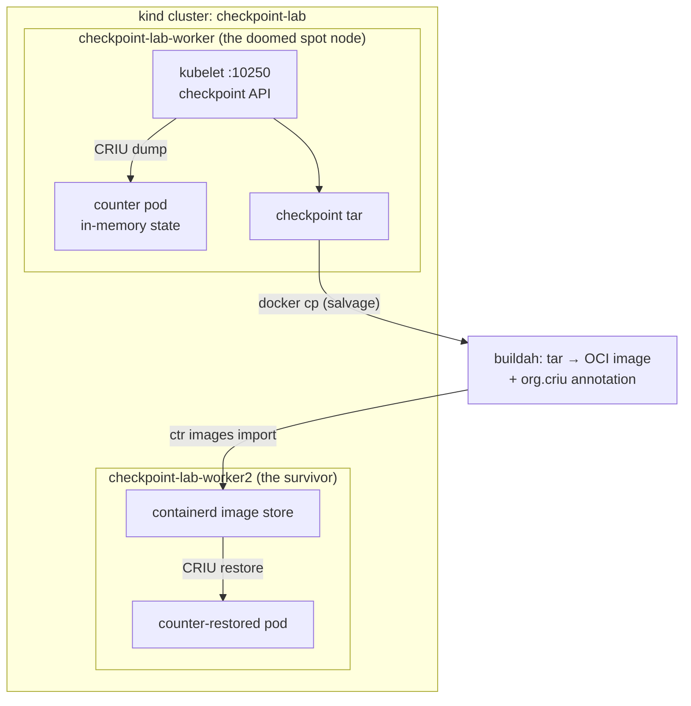

# Kubernetes Checkpoint/Restore: Surviving Spot Node Reclaims

Companion repo for the article **"How to Move a Running Pod Between Kubernetes Nodes and Survive Spot Instance Reclaims"** ([BLOG.md](BLOG.md)).

A stateful pod runs on a kind worker playing the role of a cloud spot instance. When the "two-minute warning" fires, we checkpoint the container with CRIU via the kubelet API (KEP-2008), kill the node, salvage the checkpoint archive off its disk, wrap it in an annotated OCI image, and restore the *same process* — counter, clock, warmed-up state and all — on a surviving node. Then we look at how [KEP-5823 (Pod-level Checkpoint/Restore)](https://github.com/kubernetes/enhancements/issues/5823) makes all of this native.

---

## The Architecture



---

## Prerequisites

* [Docker](https://www.docker.com/) (or [OrbStack](https://orbstack.dev/)) running
* [kind](https://kind.sigs.k8s.io/) **>= v0.33.0** (pinned: `kindest/node:v1.37.0`, containerd 2.3.4)
* [kubectl](https://kubernetes.io/docs/tasks/tools/)

Works on amd64 and arm64 (Apple Silicon). Your Docker VM's kernel must pass `criu check` — `setup.sh` verifies this for you.

---

## Quick Start (Automated)

```bash
./setup.sh   # cluster + CRIU 4.2 + containerd restore flag + app image  (~3 min)
./demo.sh    # the full scenario: deploy → checkpoint → kill node → restore
./cleanup.sh # tear everything down
```

`demo.sh` ends with the restored pod serving the counter value from the checkpoint on the surviving node, plus the total warning-to-recovery time.

---

## Manual Steps (condensed)

Follow [BLOG.md](BLOG.md) for the full walkthrough with explanations. In short:

1. **Lab**: `kind create cluster --config k8s/kind-config.yaml`, install `criu`/`checkpointctl` (Debian sid) in each node, set `enable_experimental_restore_via_create = true` in each node's `/etc/containerd/config.toml`, restart containerd. Build and `kind load` the app image from [app/](app/).
2. **Deploy**: `kubectl apply -f k8s/counter-pod.yaml`, send a few requests, save `{.status.containerStatuses[0].imageID}`.
3. **Checkpoint**: extract client cert/key from kubeconfig, `POST https://localhost:10250/checkpoint/default/counter/counter` on the worker. Inspect with `checkpointctl show`.
4. **Reclaim**: `docker stop checkpoint-lab-worker`, `kubectl delete node checkpoint-lab-worker`, salvage the tar with `docker cp` (works on stopped containers).
5. **Convert**: buildah `from scratch` + `add` tar + annotation `org.criu.checkpoint.container.name=counter` + `commit` + `push` to an `oci-archive`.
6. **Restore**: `ctr -n k8s.io images import` on worker2, alias the recorded base-image ref (`ctr images tag "$IMAGE_ID" "docker.io/library/$IMAGE_ID"` — kind-only quirk), `kubectl apply -f k8s/restore-pod.yaml`.

---

## Verifying the Restore

* The first request to `counter-restored` continues from the checkpointed counter value (post-checkpoint requests are lost — that's the point of the demo).
* `kubectl logs counter-restored` shows the *original* warmup timestamps — `main()` never re-ran.
* The response still reports the old pod's hostname and a monotonic uptime resumed from the freeze point.
* `kill -9` the restored process: the kubelet restarts it *from the checkpoint image again*.

---

## Version Pins (they matter)

| Component | Version | Why it matters |
|---|---|---|
| Kubernetes | v1.37.0 | `ContainerCheckpoint` beta/on by default (since 1.30); ships KEP-5823's CRI protobuf |
| containerd | 2.3.4 | restore-via-create exists but needs `enable_experimental_restore_via_create`; removed in 2.4 |
| CRIU | 4.2.1 | 4.1.x cannot dump TCP servers on kernels >= 6.16 ([criu#2711](https://github.com/checkpoint-restore/criu/pull/2711)) |
| kind | v0.33.0 | first release defaulting to kindest/node:v1.37.0 |
